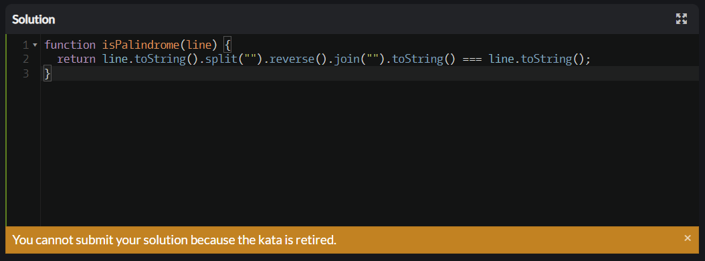

# Week 2

---

Challenges
+ ### Is Palindrome?  
  Solution  
  ```javascript
  function isPalindrome(line) {
    return line.toString().split("").reverse().join("").toString() === line.toString();
  }
  ```
  

+ ### Well Of Ideas
  Solution
  ```javascript
  function well(x){
    let val = x.filter(val => val === "good").length;
    return  val > 0 ? (val > 2 ? 'I smell a series!' : 'Publish!'):'Fail!';
  }
  ```

+ ### React Manage Events
  Solution
  ```javascript
  import React from 'react';

  export class Counter extends React.Component {
    constructor(props) {
        super(props);
        this.state = {counter : 0};
        this.increment = () => { this.setState(prevState => ({counter: prevState.counter+1}))};
        this.decrement = () => { this.setState(prevState => ({counter: prevState.counter-1}))};
    }
    render() {
        return (
            <div>
                <h1 id="counter">{this.state.counter}</h1>
                <button type="button" id="decrement" onClick={this.decrement}>
                    Decrement
                </button>
                <button type="button" id="increment" onClick={this.increment}>
                    Increment
                </button>
            </div>
        )
    }
  }
  ```

+ ### React Santa Wish List
  Solution Control the Beast
  ```javascript
  const React = require("react");

  class Beast extends React.Component {
    constructor(props) {
        super(props);
        this.state = {name:Object.keys(props).length===0?"Yeti":(props.name=""?"Yeti":props.name)};
        this.onChg = this.onChg.bind(this);
    }
  
    onChg(event){
        this.setState({name:event.target.value});
    }
  
    render(){
        return (
            <form>
                <label>Name of Beast:
                <input type="text" name={this.state.name} id="controlledName" value={this.state.name} onChange={this.onChg} />
                </label>
                <input type="submit" value="Submit" />
            </form>
        );
    }
  }
  ```
  Solution Santa Wish List   
  ```javascript
  const React = require("react");

  class WishlistForm extends React.Component {
    constructor(props) {
        super(props);
        this.props = props;
        this.state = {name:"",wish:"",priority:1};
        this.handleSubmit = this.handleSubmit.bind(this);
        this.onChg = this.onChg.bind(this);
    }

    handleSubmit(e){
        this.props.send(this.state);
        e.preventDefault();
    }

    onChg(name,value){
        this.setState({ [name]: value });
    }

    render() {
        return (
            <form onSubmit={this.handleSubmit} name="form">
                <input name="nameid" type="text" id="name" onChange={e => this.onChg('name', e.target.value)} />
                <textarea name="wish" id="wish" onChange={e => this.onChg('wish', e.target.value)} />
                <select name="priority" id="priority" onChange={e => this.onChg('priority', e.target.value)} value={this.state.priority}>
                    <option value={1}>1</option>
                    <option value={2}>2</option>
                    <option value={3}>3</option>
                    <option value={4}>4</option>
                    <option value={5}>5</option>
                </select>
                <input type="submit" value="Submit" />
            </form>
        );
    }
  };
  ```
